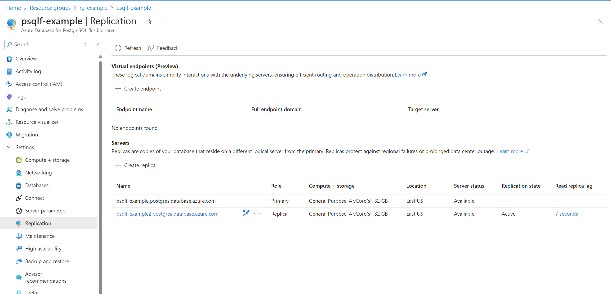

# Azure Terraform PostgreSQL Flexible Server

## Deployment

You must first be authenticated to Azure and have the appropriate subscription selected.  To authenticate:

```shell
az login
```

Select the appropriate subscription:

```shell
az account set --subscription <subscription_id>
```

Then, to deploy the resources:

```shell
terraform init
terraform apply
```

At this point, we have two Postgres servers. A primary server and a read replica. 



## Reproduce the bug 

To reproduce the bug, we will attempt to run `terraform apply` again.

```shell
terraform apply
```

You will see the following error:

```
│ Error: updating Flexible Server (Subscription: ""
│ Resource Group Name: "rg-example"
│ Flexible Server Name: "psqlf-example2"): polling after Update: polling failed: the Azure API returned the following error:
│ 
│ Status: "InternalServerError"
│ Code: ""
│ Message: "An unexpected error occured while processing the request. Tracking ID: 'b0bd2e40-9c52-4b19-aa04-72045b13b622'"
│ Activity Id: ""
│ 
│ ---
│ 
│ API Response:
│ 
│ ----[start]----
│ {"name":"dc41259f-5d2d-4208-94fe-70282f7f0b23","status":"Failed","startTime":"2024-02-20T16:01:22.63Z","error":{"code":"InternalServerError","message":"An unexpected error occured while processing the request. Tracking ID: 'b0bd2e40-9c52-4b19-aa04-72045b13b622'"}}
│ -----[end]-----
│ 
│ 
│   with azurerm_postgresql_flexible_server.postgresql_database2,
│   on database.tf line 76, in resource "azurerm_postgresql_flexible_server" "postgresql_database2":
│   76: resource "azurerm_postgresql_flexible_server" "postgresql_database2" {
│ 
```

## Teardown

To remove the resources:

```shell
terraform destroy
```